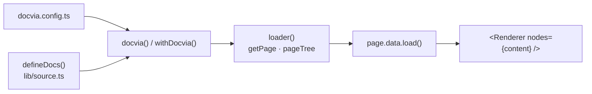

docvia is distributed as a set of `@docvia/*` packages on npm. A bundler
plugin compiles your Markdown, `@docvia/source` gives you the typed page
loader, and a renderer package turns pages into framework components.

## One command

Inside a Next.js, SvelteKit or TanStack Start app:

```bash
pnpm dlx @docvia/cli init
```

It detects the framework, package manager and import aliases, writes the pages,
routes, search endpoint and bundler config, and installs the packages. See
[the CLI guide](/docs/guide/cli#docvia-init) for what it writes. The rest of this
page is the same setup by hand.

## Install

```bash
pnpm add -D @docvia/plugin-vite   # or @docvia/plugin-next
pnpm add @docvia/source @docvia/renderer-react   # or @docvia/renderer-svelte
```

The framework plugin (which also exports `defineConfig`) is a dev dependency.
`@docvia/source` and the renderer are runtime dependencies: your pages import
them.

## Configure

`docvia.config.ts` is optional. Without it the renderer is picked from your
dependencies and Shiki is enabled when `@docvia/plugin-shiki` is installed. Add
one to register components or set plugins and Markdown options:

```ts title="docvia.config.ts"
import { defineConfig } from "@docvia/plugin-vite"; // or @docvia/plugin-next
import { createReactRenderer } from "@docvia/renderer-react";
import { shiki } from "@docvia/plugin-shiki";

export default defineConfig({
  renderer: createReactRenderer(),
  // Highlighted HTML is baked into the IR; no highlighter ships to the browser.
  plugins: [shiki({ theme: "github-dark" })],
});
```

Then add the bundler plugin: `docvia()` in `vite.config.ts`, or `withDocvia()`
in `next.config.ts`. See [Framework integration](/docs/guide/frameworks).

## Declare a collection

Collections are declared in code. The bundler plugin rewrites `defineDocs()` at
build time into an index of the folder's frontmatter plus one lazy import per
page body:

```ts title="lib/source.ts"
import { loader } from "@docvia/source";
import { defineDocs } from "@docvia/source/macro";
import { z } from "zod";

const docs = defineDocs({
  dir: "content/docs",
  // Optional: extra frontmatter fields, any Standard Schema library.
  docs: { schema: z.object({ author: z.string().optional() }) },
});

export const source = loader({ baseUrl: "/docs", source: docs.toDocviaSource() });
```

`dir` must be a string literal and defaults to `content/docs`. Components
registered in `docvia.config.ts` come from a second macro:

```ts title="lib/registry.ts"
import { defineRegistry } from "@docvia/source/macro";

export const registry = defineRegistry();
```

## Render a page

`getPage()` is synchronous and returns frontmatter only. The compiled body
loads on demand:

```ts
const page = source.getPage(slugs);
if (!page) notFound();
const { content, toc, headings, manifest, structuredData } = await page.data.load();
```

Pass `content` to the renderer (`<DocviaContent nodes={content} registry={registry} />`
in React, `<Renderer nodes={content} {registry} />` in Svelte). Build the
sidebar from `source.pageTree`, and pre-render routes with
`source.generateParams()`.



Nothing is written to disk: there is no `.docvia/` folder and no sync step.
Pages compile lazily in memory, keyed by content hash, in dev and in
production builds.

## Order the sidebar

Add a `meta.json` to any content folder to set its title and child order:

```json title="content/docs/guide/meta.json"
{
  "title": "Guide",
  "pages": ["install", "---Usage---", "...", "!drafts", "[GitHub](https://github.com/kanakkholwal/docvia)"],
  "defaultOpen": true
}
```

`...` inserts the remaining pages, `---Label---` adds a separator, `!name`
excludes an entry, and `[Text](url)` adds a link. `root: true` marks the folder
as a separate sidebar root.

Every config option is documented in the
[Configuration reference](/docs/guide/configuration).
