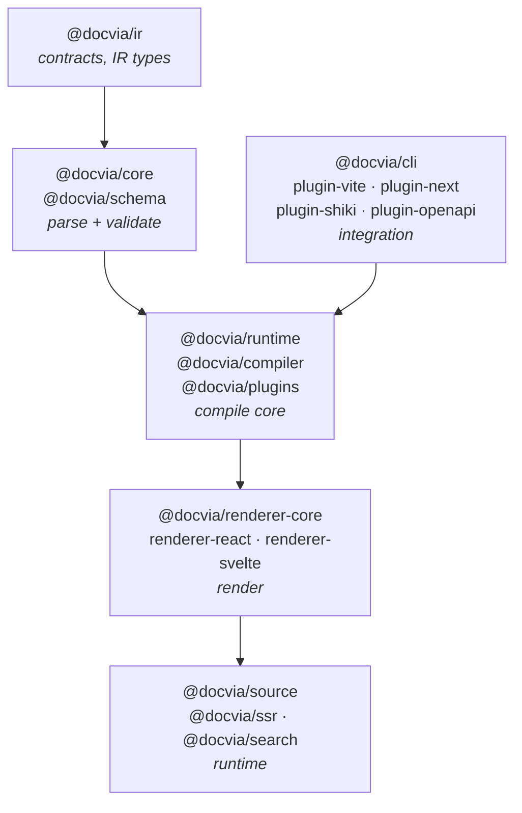
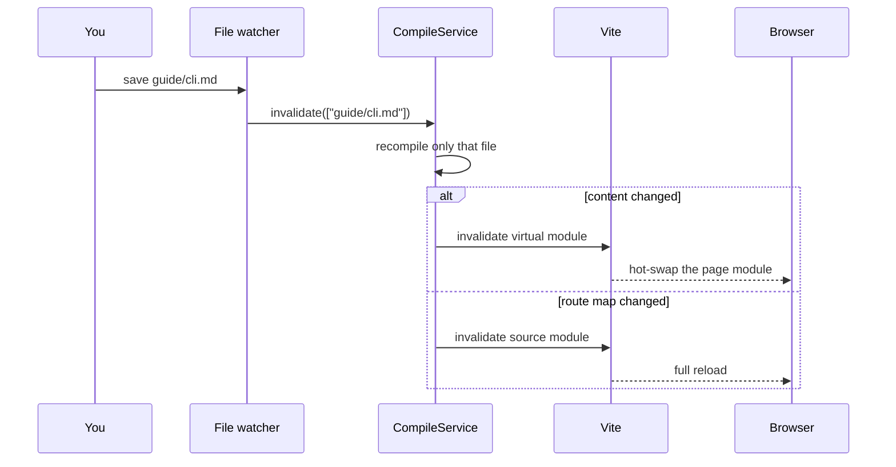
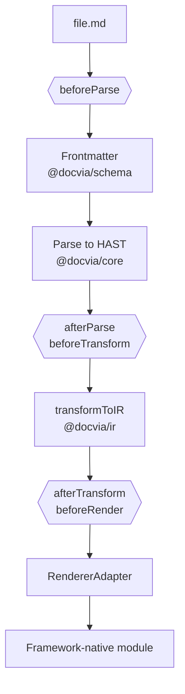
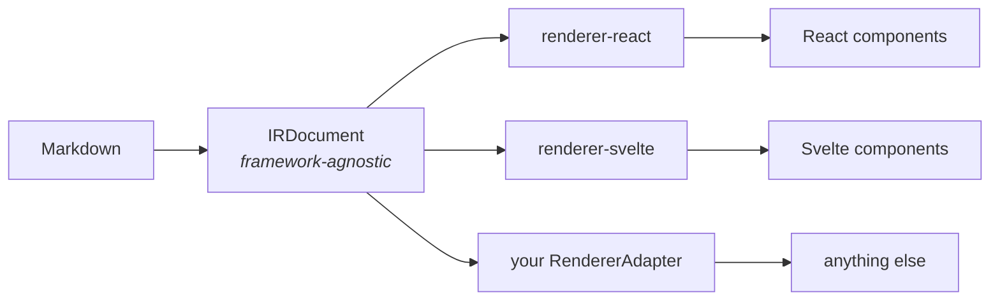

docvia is a small set of packages arranged around one idea: parse Markdown
into a framework-agnostic Intermediate Representation (IR), then let a renderer
turn that IR into framework-native output. The same compile core does this at
build time, inside a dev server, and per request, so output is identical
across all three.

## The compile core

At the centre is [`@docvia/runtime`](/docs/packages/runtime)'s
**`CompileService`**, a stateful, long-lived object that holds the resolved
config, the plugin runner, the incremental cache, and the in-memory module
graph for the lifetime of a process.

Every docvia mode drives this one service, which is why their output never
drifts:

| Mode | Driven by | What it does |
|---|---|---|
| **Build** | [`@docvia/compiler`](/docs/packages/compiler) | Compiles the whole tree once and emits the on-disk module graph (thin glue that imports the Markdown in place). |
| **Dev** | [`@docvia/plugin-vite`](/docs/packages/plugin-vite), [`@docvia/plugin-next`](/docs/packages/plugin-next) | Runs the service in-process inside the bundler and recompiles incrementally on every file change. |
| **SSR** | [`@docvia/ssr`](/docs/packages/ssr) | Renders a single document per request, on Node or the edge. |

`compile()`, the classic batch entry point, is now a thin wrapper over
`CompileService`. The key methods are `compileAll()`, `compileFile()`,
`invalidate(filePaths)` for incremental recompilation, `getDocument()`, and the
module-graph emitters.

## The three run modes

### Build

`docvia build` (or `compile()`) walks `sourceDir` once, compiles every file,
and emits the on-disk module graph, thin glue that imports the Markdown in
place. This is the ahead-of-time path; see
[the module graph](#the-generated-module-graph) below.

### Dev

The bundler plugins run `CompileService` **in-process**, so there is no separate
`docvia build` step. The service watches `sourceDir` and recompiles
incrementally through `invalidate()`: a content-only change hot-swaps the
affected module, a route-map change triggers a reload. Under Vite,
`virtual:docvia/source` is served as an in-memory **virtual module**, so nothing
is written to disk during development.

### SSR

Because `source.ts` uses **static** `?docvia` imports, a framework app on Vite
or Next.js, including on the edge, already renders pages at request time by
calling `docs.getPage(...)`; the content is bundled in. No extra package is
required.

For a **non-framework Node server**, [`@docvia/ssr`](/docs/packages/ssr) renders one
document per request. `createDocviaSSR({ provider })` resolves IR through a
generic `ContentSource`, which can be a `ContentProvider`, a live
`CompileService` (it already satisfies the shape), or a
`(collection, slug) => IR` function. It renders with the shared pipeline and
caches rendered pages in an in-memory LRU keyed by content hash. The package
itself never touches the filesystem, so it is edge-safe regardless of source.

## The compile pipeline

Whichever mode is active, each `.md` file runs through this sequence:

1. **`beforeParse`.** Plugins rewrite the raw file.
2. **Frontmatter.** [`@docvia/schema`](/docs/packages/schema) splits the YAML
   block and validates it.
3. **Parse.** [`@docvia/core`](/docs/packages/core) turns the Markdown body into a
   sanitized HAST tree (`unified` + `remark` + `rehype`).
4. **`afterParse`** / **`beforeTransform`.** Plugins manipulate the AST.
5. **Transform.** [`@docvia/ir`](/docs/packages/ir)'s `transformToIR` converts the
   HAST tree into an `IRDocument`.
6. **`afterTransform`** / **`beforeRender`.** Plugins manipulate the IR. This
   is where [`@docvia/plugin-shiki`](/docs/packages/plugin-shiki) highlights code
   blocks and bakes the HTML into the IR.
7. **Render.** The configured `RendererAdapter` turns the `IRDocument` into a
   framework-native module.

Plugin hooks are interleaved at five fixed points. See
[Writing plugins](/docs/guide/plugins).

## The Intermediate Representation

The IR is the contract that decouples Markdown from any framework. An
`IRDocument` is a normalized tree of `IRNode`s with HTML-native prop names. No
`className`, no style objects, no framework-specific attributes.

Because the IR is framework-agnostic, the same compiled document can be
rendered by the React adapter, the Svelte adapter, or any custom
`RendererAdapter` you write. The IR is also where docvia enforces safety:
`transformToIR` drops blocked tags such as `script` and `iframe`.

Syntax highlighting is a **build-time IR transform**, not a render-time step.
A highlighter plugin populates `props.html` on `code-block` nodes during
`beforeRender`, so the IR ships pre-highlighted, and **no syntax highlighter
ships to the browser or the edge bundle**. Highlighting is pluggable: Shiki is
the default (`@docvia/plugin-shiki`), and any highlighter can be wired the
same way.

`@docvia/ir` is deliberately dependency-light (only `github-slugger`), so every
other package can import its types without pulling in a heavy tree.

## The generated module graph

A build writes a typed module graph into `outDir` (default `.docvia/`). No page
content is emitted; the content stays in the `.md`, compiled in place by the
bundler's `?docvia` transform. The graph is just thin glue:

| File | Purpose |
|---|---|
| `source.ts` | The typed collection helpers: `getPage`, `getPages`, `pageTree`, `generateParams`. **Eager** `?docvia` imports, for server/SSR. |
| `browser.ts` | The **lazy**, client counterpart. One `() => import()` per page, so each page code-splits into its own chunk. |
| `dynamic.ts` | The page module map the collections read from. |
| `registry.ts` | The component registry for `:::component` directives (only when components are configured). |
| `types.d.ts` | Generated frontmatter and route-key types per collection. |
| `.docvia.cache.json` | The incremental build cache. |

A project-root `docvia-env.d.ts` is also emitted so the source import specifier
type-checks (`virtual:docvia/source` on Vite, `docvia/source` on Next.js, each
with a `/browser` counterpart).

Your app never imports the compiler or a Markdown parser. It imports the source
module, which is plain generated TypeScript (under Vite, a virtual module served
by the plugin) backed by these files.

## The package map

| Layer | Packages |
|---|---|
| Contracts | [`@docvia/ir`](/docs/packages/ir) |
| Parsing | [`@docvia/core`](/docs/packages/core), [`@docvia/schema`](/docs/packages/schema) |
| Compile core | [`@docvia/runtime`](/docs/packages/runtime), [`@docvia/compiler`](/docs/packages/compiler), [`@docvia/plugins`](/docs/packages/plugins) |
| Rendering | [`@docvia/renderer-core`](/docs/packages/renderer-core), [`@docvia/renderer-react`](/docs/packages/renderer-react), [`@docvia/renderer-svelte`](/docs/packages/renderer-svelte) |
| Runtime | [`@docvia/source`](/docs/packages/source), [`@docvia/ssr`](/docs/packages/ssr), [`@docvia/search`](/docs/packages/search) |
| Integration | [`@docvia/cli`](/docs/packages/cli), [`@docvia/plugin-vite`](/docs/packages/plugin-vite), [`@docvia/plugin-next`](/docs/packages/plugin-next), [`@docvia/plugin-shiki`](/docs/packages/plugin-shiki), [`@docvia/plugin-mermaid`](/docs/packages/plugin-mermaid), [`@docvia/plugin-openapi`](/docs/packages/plugin-openapi) |

The [Packages](/docs/packages) section documents each one in depth.
