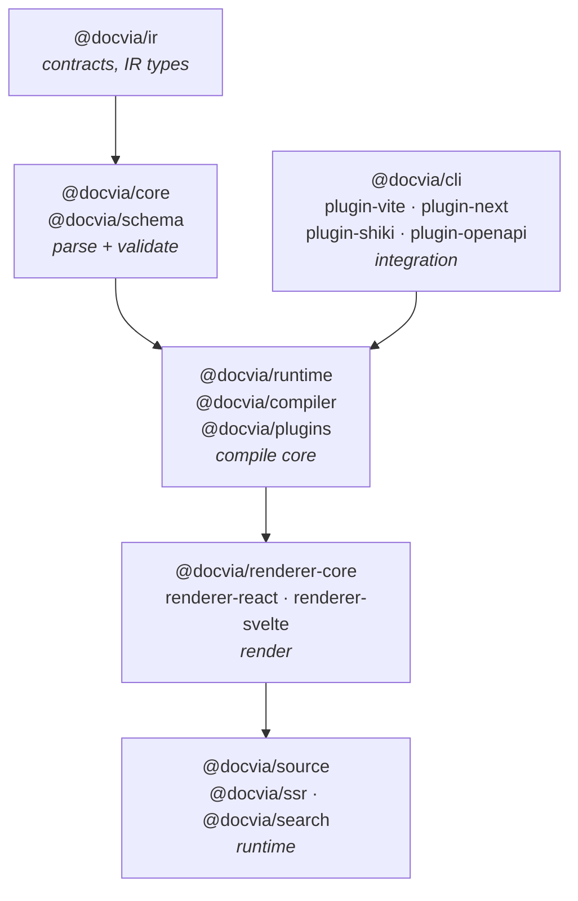
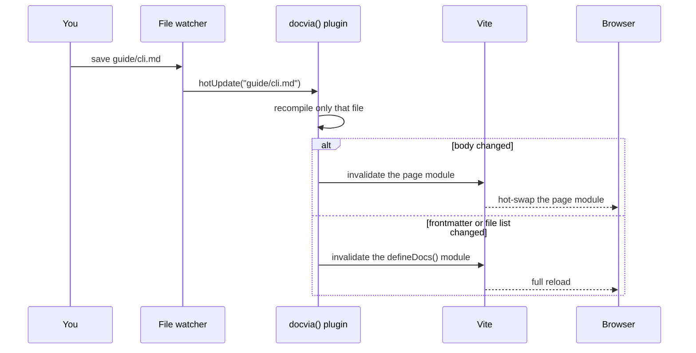
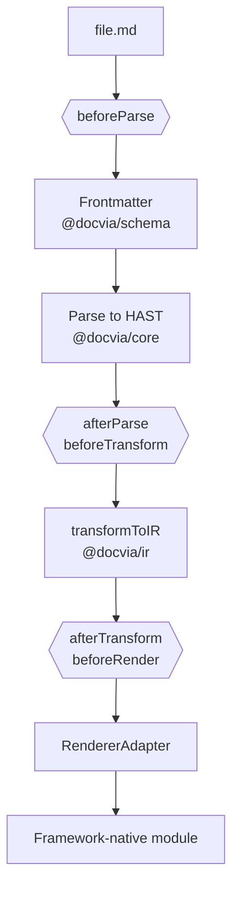
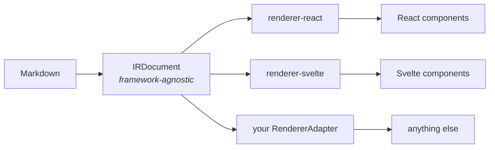

docvia is a small set of packages arranged around one idea: parse Markdown
into a framework-agnostic Intermediate Representation (IR), then let a renderer
turn that IR into framework-native output. The same compile core does this at
build time, inside a dev server, and per request, so output is identical
across all three.

```mermaid
%% title: Package layers
flowchart TD
  IR["@docvia/ir<br/><i>contracts, IR types</i>"]
  CORE["@docvia/core<br/>@docvia/schema<br/><i>parse + validate</i>"]
  RT["@docvia/runtime<br/>@docvia/compiler<br/>@docvia/plugins<br/><i>compile core</i>"]
  REN["@docvia/renderer-core<br/>renderer-react · renderer-svelte<br/><i>render</i>"]
  RUN["@docvia/source<br/>@docvia/ssr · @docvia/search<br/><i>runtime</i>"]
  INT["@docvia/cli<br/>plugin-vite · plugin-next<br/>plugin-shiki · plugin-openapi<br/><i>integration</i>"]

  IR --> CORE --> RT --> REN --> RUN
  INT --> RT
```

## The compile core

At the centre is [`@docvia/runtime`](/docs/packages/runtime)'s
**`PagePipeline`**. It holds the resolved config and the plugin runner, reads
frontmatter without parsing Markdown (`meta()`), and compiles a page on demand
(`document()`, `module()`), memoised in memory by content hash.

Every docvia mode drives this one pipeline, which is why their output never
drifts:

| Mode | Driven by | What it does |
|---|---|---|
| **App build and dev** | [`@docvia/plugin-vite`](/docs/packages/plugin-vite), [`@docvia/plugin-next`](/docs/packages/plugin-next) | Rewrites `defineDocs()` into a frontmatter index plus lazy page imports, and compiles each page when the bundler requests it. |
| **Standalone build** | [`@docvia/cli`](/docs/packages/cli), [`@docvia/compiler`](/docs/packages/compiler) | `CompileService` compiles the whole tree once and emits a module graph to `outDir`. |
| **SSR** | [`@docvia/ssr`](/docs/packages/ssr) | Renders a single document per request, on Node or the edge. |

`CompileService` is the batch wrapper over `PagePipeline` for hosts that need
everything up front: `compileAll()`, `compileFile()`, `invalidate(filePaths)`,
`getDocument()`, and the module-graph emitters.

## The three run modes

### Build

`vite build` or `next build` runs the bundler plugin, which rewrites each
`defineDocs()` call and compiles every page the bundle imports. Nothing is
written outside the bundle. Without a bundler, `docvia build` emits a module
graph instead; see the [CLI guide](/docs/guide/cli).

### Dev

The bundler plugins compile **in-process**, so there is no separate build
step. Each collection folder is watched (even outside the project root): a
body-only change recompiles and hot-swaps that page's module; a frontmatter
edit, or adding, renaming, or deleting a page, re-indexes the collection and
reloads, with no dev-server restart. Nothing is written to disk.

```mermaid
%% title: What happens when you save a Markdown file in dev
sequenceDiagram
  participant You
  participant Watcher as File watcher
  participant CS as docvia() plugin
  participant Vite
  participant Browser

  You->>Watcher: save guide/cli.md
  Watcher->>CS: hotUpdate("guide/cli.md")
  CS->>CS: recompile only that file
  alt body changed
    CS->>Vite: invalidate the page module
    Vite-->>Browser: hot-swap the page module
  else frontmatter or file list changed
    CS->>Vite: invalidate the defineDocs() module
    Vite-->>Browser: full reload
  end
```

### SSR

A framework app on Vite or Next.js, including on the edge, already renders
pages at request time with `source.getPage()` and `page.data.load()`; the
compiled bodies are bundled in as lazy chunks. No extra package is required.

For a **non-framework Node server**, [`@docvia/ssr`](/docs/packages/ssr) renders one
document per request. `createDocviaSSR({ provider })` resolves IR through a
generic `ContentSource`, which can be a `ContentProvider`, a live
`CompileService` (it already satisfies the shape), or a
`(collection, slug) => IR` function. It renders with the shared pipeline and
caches rendered pages in an in-memory LRU keyed by content hash. The package
itself never touches the filesystem, so it is edge-safe regardless of source.

## The compile pipeline

Whichever mode is active, each `.md` file runs through this sequence:

```mermaid
%% title: The seven stages of a compile
flowchart TD
  F["file.md"] --> H1{{"beforeParse"}}
  H1 --> FM["Frontmatter<br/>@docvia/schema"]
  FM --> PA["Parse to HAST<br/>@docvia/core"]
  PA --> H2{{"afterParse<br/>beforeTransform"}}
  H2 --> TR["transformToIR<br/>@docvia/ir"]
  TR --> H3{{"afterTransform<br/>beforeRender"}}
  H3 --> RE["RendererAdapter"]
  RE --> OUT["Framework-native module"]
```

1. **`beforeParse`.** Plugins rewrite the raw file.
2. **Frontmatter.** [`@docvia/schema`](/docs/packages/schema) splits the YAML
   block and validates it.
3. **Parse.** [`@docvia/core`](/docs/packages/core) turns the Markdown body into a
   sanitized HAST tree (`unified` + `remark` + `rehype`).
4. **`afterParse`** / **`beforeTransform`.** Plugins manipulate the AST.
5. **Transform.** [`@docvia/ir`](/docs/packages/ir)'s `transformToIR` converts the
   HAST tree into an `IRDocument`.
6. **`afterTransform`** / **`beforeRender`.** Plugins manipulate the IR. This
   is where [`@docvia/plugin-shiki`](/docs/packages/plugin-shiki) highlights code
   blocks and bakes the HTML into the IR.
7. **Render.** The configured `RendererAdapter` turns the `IRDocument` into a
   framework-native module.

Plugin hooks are interleaved at five fixed points. See
[Writing plugins](/docs/guide/plugins).

## The Intermediate Representation

The IR is the contract that decouples Markdown from any framework. An
`IRDocument` is a normalized tree of `IRNode`s with HTML-native prop names. No
`className`, no style objects, no framework-specific attributes.

```mermaid
%% title: One IR, many renderers
flowchart LR
  MD["Markdown"] --> IRD["IRDocument<br/><i>framework-agnostic</i>"]
  IRD --> RR["renderer-react"] --> RC["React components"]
  IRD --> RS["renderer-svelte"] --> SC["Svelte components"]
  IRD --> RX["your RendererAdapter"] --> XC["anything else"]
```

Because the IR is framework-agnostic, the same compiled document can be
rendered by the React adapter, the Svelte adapter, or any custom
`RendererAdapter` you write. The IR is also where docvia enforces safety:
`transformToIR` drops blocked tags such as `script` and `iframe`.

Syntax highlighting is a **build-time IR transform**, not a render-time step.
A highlighter plugin populates `props.html` on `code-block` nodes during
`beforeRender`, so the IR ships pre-highlighted, and **no syntax highlighter
ships to the browser or the edge bundle**. Highlighting is pluggable: Shiki is
the default (`@docvia/plugin-shiki`), and any highlighter can be wired the
same way.

`@docvia/ir` is deliberately dependency-light (only `github-slugger`), so every
other package can import its types without pulling in a heavy tree.

## What defineDocs() becomes

The bundler plugin rewrites each `defineDocs()` call into a runtime call that
carries:

| Part | Contents |
|---|---|
| Frontmatter index | Every page's validated frontmatter, inlined. Read without parsing Markdown. |
| Page bodies | One lazy `?docvia` import per page (`import.meta.glob` on Vite), so each body is its own chunk. |
| `meta.json` files | Folder titles and ordering. |

`loader()` turns that into `getPage`, `getPages`, `pageTree`, and
`generateParams`. A `?docvia` import is compiled by the plugin's transform the
first time the bundler requests it. `defineRegistry()` becomes a registry with
real imports of the components in `docvia.config.ts`.

Your app never imports the compiler or a Markdown parser, and no files are
generated: frontmatter types come from the `defineDocs()` schema.

> Legacy config collections and the standalone `docvia build` still emit a
> module graph (`source.ts`, `browser.ts`, `registry.ts`, `.d.ts` files) into
> `outDir`, imported through `virtual:docvia/source` or `docvia/source`.

## The package map

| Layer | Packages |
|---|---|
| Contracts | [`@docvia/ir`](/docs/packages/ir) |
| Parsing | [`@docvia/core`](/docs/packages/core), [`@docvia/schema`](/docs/packages/schema) |
| Compile core | [`@docvia/runtime`](/docs/packages/runtime), [`@docvia/compiler`](/docs/packages/compiler), [`@docvia/plugins`](/docs/packages/plugins) |
| Rendering | [`@docvia/renderer-core`](/docs/packages/renderer-core), [`@docvia/renderer-react`](/docs/packages/renderer-react), [`@docvia/renderer-svelte`](/docs/packages/renderer-svelte) |
| Runtime | [`@docvia/source`](/docs/packages/source), [`@docvia/ssr`](/docs/packages/ssr), [`@docvia/search`](/docs/packages/search) |
| Integration | [`@docvia/cli`](/docs/packages/cli), [`@docvia/plugin-vite`](/docs/packages/plugin-vite), [`@docvia/plugin-next`](/docs/packages/plugin-next), [`@docvia/plugin-shiki`](/docs/packages/plugin-shiki), [`@docvia/plugin-mermaid`](/docs/packages/plugin-mermaid), [`@docvia/plugin-openapi`](/docs/packages/plugin-openapi) |

The [Packages](/docs/packages) section documents each one in depth.
