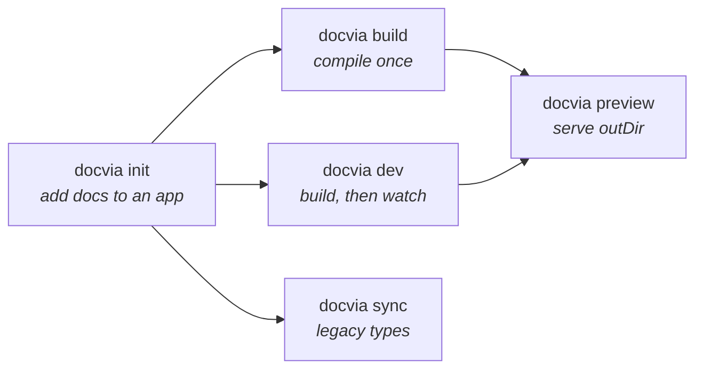

The `docvia` command is provided by [`@docvia/cli`](/docs/packages/cli). Install it
as a dev dependency and invoke it through your package manager:

```bash
pnpm add -D @docvia/cli
npx docvia <command>
```

Run `docvia --version` to print the installed version.

Apps on Vite or Next.js do not need the CLI: the bundler plugin compiles pages
in-process and nothing is generated on disk. The CLI is for `docvia init` and for
standalone builds without a bundler.



## docvia init

Add docs to an existing Next.js, SvelteKit or TanStack Start app.

```bash
pnpm dlx @docvia/cli init [dir] [--yes] [--no-install] [--framework <name>] [--pm <manager>] [-f]
```

| Flag | Default | Description |
|---|---|---|
| `[dir]` | `.` | The app directory. |
| `-y, --yes` | `false` | Accept the detected setup without prompting. |
| `--no-install` | installs | Print the install commands instead of running them. |
| `--framework <name>` | detected | `next`, `sveltekit`, `tanstack-start` or `standalone`. |
| `--pm <manager>` | detected | `npm`, `pnpm`, `yarn` or `bun`. |
| `-f, --force` | `false` | Replace files that already exist. |

What it detects:

- **Framework** from `package.json`: `next`, `@sveltejs/kit` or `@tanstack/react-start`.
- **Package manager** from the lockfile, then the `packageManager` field, then the command that ran it.
- **Import aliases** from `tsconfig.json` `paths` and `package.json` `imports` (`@/lib/source`, `#lib/source.ts`), with relative imports as the fallback.
- **`src/` layout** for Next.js apps that use `src/app`.
- **Tailwind v4**: adds `@source not "../content"` to the app's Tailwind stylesheet, so a
  Markdown edit does not rebuild the app's CSS (about 9 s per edit through Next.js PostCSS).

What it writes, shown for Next.js. SvelteKit and TanStack Start get the same pieces as their own route files:

| File | Purpose |
|---|---|
| `content/docs/index.md`, `content/docs/guides/` | Starter pages and a `meta.json` |
| `lib/source.ts` | `defineDocs()` and `loader()` |
| `app/docs/layout.tsx`, `app/docs/[[...slug]]/page.tsx`, `docs.css` | Sidebar, page, table of contents, starter styles |
| `app/api/search/route.ts` | Search endpoint |
| `components/docs-tree.tsx`, `components/docvia-client.tsx` | Sidebar tree and code-tab switching |
| `next.config.ts` | Wrapped in `withDocvia()` (Vite apps get `docvia()` in `plugins`) |

Existing files are kept unless you pass `--force`. No `docvia.config.ts` is written: the
renderer is picked from your dependencies and Shiki is enabled when installed. Add a config
file only to register components or change plugins.

In a directory without a supported framework, `init` sets up a standalone project for
`docvia build` and `docvia dev` instead.

## docvia build

Compile every Markdown file once.

```bash
docvia build [--docs <dir>] [--out <dir>] [--config <path>] [-v]
```

| Flag | Default | Description |
|---|---|---|
| `--docs <dir>` | from config | Override `sourceDir`. |
| `--out <dir>` | from config | Override `outDir`. |
| `--config <path>` | `./docvia.config.ts` | Path to the config file. |
| `-v, --verbose` | `false` | Show intermediate build steps. |

`build` loads the config, compiles every file, and writes the module graph to
`outDir`. Every run is a full compile: there is no on-disk cache. It fails with
a `CONFIG_ERROR` if the docs directory is missing or no `renderer` is
configured. On success it prints the build duration and the page count.

## docvia dev

Build once, then watch and rebuild incrementally.

```bash
docvia dev [--docs <dir>] [--out <dir>] [--config <path>] [-v]
```

| Flag | Default | Description |
|---|---|---|
| `--docs <dir>` | from config | Override `sourceDir`. |
| `--out <dir>` | from config | Override `outDir`. |
| `--config <path>` | `./docvia.config.ts` | Path to the config file. |
| `-v, --verbose` | `false` | Show each changed file as it rebuilds. |

`dev` does an initial build, then watches both `sourceDir` and the config file
on a single long-lived `CompileService`. Each change recompiles only the
affected files through the service's incremental `invalidate()`, so a full
rebuild is not repeated per change. A config change recreates the service. An
initial-build failure does not stop the watcher; fix the error and save again.
`Ctrl+C` shuts the watcher down cleanly.

> `docvia dev` is a standalone watcher for the `outDir` output. In a Vite or
> Next.js app, the bundler plugin compiles in-process and handles watching
> itself. See [Framework integration](/docs/guide/frameworks).

## docvia sync

Write the legacy `.docvia/types.d.ts` and `.docvia/env.d.ts` without a
bundler. Only config collections (imported through `virtual:docvia/source` or
`docvia/source`) need it; `defineDocs()` apps take their types from their own
source file.

```bash
docvia sync [--config <path>]
```

| Flag | Default | Description |
|---|---|---|
| `--config <path>` | auto-detected | Path to the config file. |

A fresh CI checkout has none of these files, so legacy setups run `sync`
before type-checking:

```json
{
  "scripts": {
    "check": "docvia sync && svelte-kit sync && svelte-check"
  }
}
```

## docvia preview

Serve the output of a standalone `docvia build`.

```bash
docvia preview [--out <dir>] [-p <port>]
```

| Flag | Default | Description |
|---|---|---|
| `--out <dir>` | `.docvia` | Output directory to serve. |
| `-p, --port <port>` | `4173` | Port to listen on. |

`preview` serves `outDir` over `sirv`. It is a sanity check for the compiled
module graph, not a runtime. Use a framework integration for a real site.

## Programmatic use

The CLI is also importable. `runCli` is the entry point the `docvia` binary
calls. `defineConfig` is re-exported too, but import it from
`@docvia/build/vite` or `@docvia/build/next` in `docvia.config.ts`:

```ts
import { runCli } from "@docvia/cli";

await runCli(["node", "docvia", "build", "--verbose"]);
```

See [`@docvia/cli`](/docs/packages/cli) for the full package reference.
