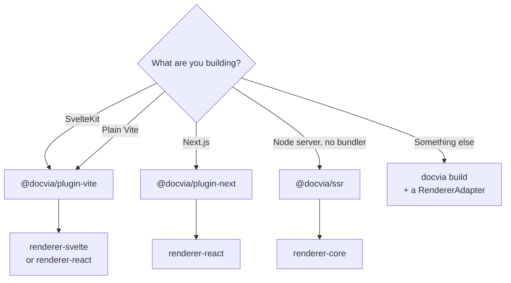

The recommended way to use docvia is to run it **in-process** inside your
bundler. The Vite plugin and the Next.js wrapper both drive the compile core
directly, so there is no separate `docvia build` step, dev recompiles
incrementally as you edit, and the compiled source module is resolved for you
(`virtual:docvia/source` on Vite, `docvia/source` on Next.js).

The pattern is the same everywhere:

1. Author a `docvia.config.ts` with the renderer that matches your framework.
2. Add the framework's docvia plugin / wrapper.
3. Import compiled pages from the source module and render them with the
   framework renderer.



This page covers SvelteKit, Next.js, plain Vite, and server-side rendering.

## SvelteKit

SvelteKit runs on Vite, so the integration is the single `docvia()` plugin
from [`@docvia/plugin-vite`](/docs/packages/plugin-vite).

### 1. Install

```bash
pnpm add -D @docvia/plugin-vite @docvia/cli
pnpm add @docvia/renderer-svelte @docvia/source
```

### 2. Configure docvia

Use the Svelte renderer, taking care to use the `/node` subpath, which is the
build-time entry point. Add `@docvia/plugin-shiki` for syntax highlighting.

```ts
// docvia.config.ts
import { defineConfig } from "@docvia/cli";
import { createSvelteRenderer } from "@docvia/renderer-svelte/node";
import { shiki } from "@docvia/plugin-shiki";

export default defineConfig({
  sourceDir: "src/docs",
  outDir: ".docvia",
  collections: [{ name: "docs", sourceDir: "src/docs", baseUrl: "/docs" }],
  renderer: createSvelteRenderer(),
  plugins: [shiki({ theme: "github-dark" })],
});
```

### 3. Add the Vite plugin

`docvia()` runs the `CompileService` in-process. Following the Vite
virtual-module convention it serves `virtual:docvia/source` (and
`virtual:docvia/source/browser`) from its `load` hook, in dev with incremental
recompilation (HMR) and for production builds alike.

```ts
// vite.config.ts
import { docvia } from "@docvia/plugin-vite";
import { sveltekit } from "@sveltejs/kit/vite";
import { defineConfig } from "vite";
import docviaConfig from "./docvia.config";

export default defineConfig({
  plugins: [sveltekit(), docvia(docviaConfig)],
});
```

That is the whole setup. Your workflow stays `pnpm dev` and `pnpm build`;
`docvia()` compiles your Markdown as part of each.

### 4. Declare the module types

docvia writes a `docvia-env.d.ts` at the project root for you so the virtual
modules resolve in TypeScript. It looks like this:

```ts
declare module "virtual:docvia/source" {
  const source: typeof import("./.docvia/source");
  export const docviaSource: typeof source.docviaSource;
  export const docs: typeof source.docs;
  export const registry: typeof source.registry;
}
declare module "virtual:docvia/source/browser" {
  const browser: typeof import("./.docvia/browser");
  export const docs: typeof browser.docs;
}
```

### 5. Consume pages in a route

A catch-all route loads the page on the server and renders it with the
`Renderer` component from `@docvia/renderer-svelte`.

```ts
// src/routes/docs/[...slug]/+page.server.ts
import { error } from "@sveltejs/kit";
import { docs } from "virtual:docvia/source";
import type { PageServerLoad } from "./$types";

export const load: PageServerLoad = async ({ params }) => {
  const page = await docs.getPage(params.slug ? params.slug.split("/") : []);
  if (!page) throw error(404, "Page not found");
  return { page };
};
```

```svelte
<!-- src/routes/docs/[...slug]/+page.svelte -->
<script lang="ts">
  import { Renderer } from "@docvia/renderer-svelte";
  import { registry } from "virtual:docvia/source";
  import type { PageProps } from "./$types";

  let { data }: PageProps = $props();
</script>

<article>
  <Renderer nodes={data.page.content} {registry} />
</article>
```

Build the sidebar from `docs.pageTree` and you have a fully docvia-driven docs
section. The [`apps/web`](https://github.com/kanakkholwal/docvia/tree/main/apps/web)
app in this repository is a complete working example: the site you are reading
is compiled by docvia.

## Next.js

For Next.js, [`@docvia/plugin-next`](/docs/packages/plugin-next) does the wiring. It
drives the compile core when the Next config is evaluated and aliases
`docvia/source` for **both webpack and Turbopack**.

### 1. Install

```bash
pnpm add -D @docvia/plugin-next @docvia/cli
pnpm add @docvia/renderer-react @docvia/source react react-dom
```

### 2. Configure docvia

```ts
// docvia.config.ts
import { defineConfig } from "@docvia/cli";
import { createReactRenderer } from "@docvia/renderer-react";
import { shiki } from "@docvia/plugin-shiki";

export default defineConfig({
  sourceDir: "docs",
  outDir: ".docvia",
  renderer: createReactRenderer(),
  plugins: [shiki({ theme: "github-dark" })],
});
```

### 3. Wrap the Next config

```js
// next.config.mjs
import { withDocvia } from "@docvia/plugin-next";

export default withDocvia({ configPath: "./docvia.config.ts" })({
  reactStrictMode: true,
});
```

`withDocvia` runs `CompileService` on config evaluation, aliases
`docvia/source` and `docvia/registry` for webpack and Turbopack alike, and in
dev starts an incremental watcher that recompiles changed files through
`service.invalidate()`. A cross-process lock (`.docvia-build.lock`) keeps
concurrent Next.js workers from compiling at once.

### 4. Consume pages in a route

```tsx
// app/docs/[[...slug]]/page.tsx
import { docviaSource } from "docvia/source";
import { DocviaContent } from "@docvia/renderer-react";

export function generateStaticParams() {
  return docviaSource.collections.docs.generateParams("slug");
}

export default async function DocPage({
  params,
}: {
  params: { slug?: string[] };
}) {
  const page = await docviaSource.collections.docs.getPage(params.slug);
  if (!page) return null;
  return <DocviaContent nodes={page.content} />;
}
```

`DocviaContent` carries no `"use client"` directive, so it renders as a React
Server Component. For interactive component islands, hydrate them on the client
with `hydrate` from `@docvia/renderer-react/client`.

## Plain Vite (React or Svelte)

Without SvelteKit or Next.js, use the same `docvia()` plugin directly in
`vite.config.ts`:

```ts
import { docvia } from "@docvia/plugin-vite";
import docviaConfig from "./docvia.config";

export default {
  plugins: [docvia(docviaConfig)],
};
```

You can also import a single page directly through the `?docvia` transform:

```ts
import page from "./docs/index.md?docvia";
```

## Server-side rendering

**On the edge or inside a framework app, you usually need nothing extra.** The
generated `source.ts` uses **static** `?docvia` imports, so the page content is
bundled directly into your server output. Importing `virtual:docvia/source`
(Vite) or `docvia/source` (Next.js) and calling `docs.getPage(...)` works at
request time on Cloudflare Workers and other edge runtimes. There is no
`node:fs` and no Markdown parsing on the request path:

```ts
import { docs } from "virtual:docvia/source"; // Next.js: "docvia/source"

const page = await docs.getPage(["getting-started"]); // works on the edge
```

> [!WARNING]
> **Import the collection from server-only modules.** The flip side of those
> static imports is that `virtual:docvia/source` pulls in *every* compiled page.
> That is exactly what you want in a server bundle. In a **universal** module,
> such as a SvelteKit `+page.ts` or a `"use client"` component, it means your
> entire content set is shipped to the browser, silently undoing the bundle-size
> benefit the compiler exists to provide.
>
> Load pages in `+page.server.ts` / `+layout.server.ts` / a React Server
> Component, and pass the result down. If you truly need a collection on the
> client, import `virtual:docvia/source/browser` (Next.js: `docvia/source/browser`)
> instead. It code-splits one chunk per page and fetches only what you ask for.

For a **non-framework Node server** that renders per request, use
[`@docvia/ssr`](/docs/packages/ssr). It renders one document per request and caches
rendered pages in an in-memory LRU keyed by content hash. `createDocviaSSR`
takes a generic content source. A live `CompileService` already satisfies the
shape, so pass it directly, or pass a `(collection, slug) => IR` function:

```ts
import { createDocviaSSR } from "@docvia/ssr";

const ssr = createDocviaSSR({ provider: service }); // or (collection, slug) => IR
const page = await ssr.render("docs", "getting-started");
```

## Standalone preview

`docvia preview` serves the raw `.docvia/` output over `sirv`:

```bash
docvia preview --out .docvia --port 4173
```

This is a sanity check for the compiled module graph, **not** a runtime.
For an actual site, use one of the integrations above.

## Choosing an approach

| Your app | Integration | Renderer |
|---|---|---|
| SvelteKit | `@docvia/plugin-vite` (`docvia()`) | `@docvia/renderer-svelte` |
| Next.js (webpack or Turbopack) | `@docvia/plugin-next` | `@docvia/renderer-react` |
| Plain Vite (Svelte) | `@docvia/plugin-vite` (`docvia()`) | `@docvia/renderer-svelte` |
| Plain Vite (React) | `@docvia/plugin-vite` (`docvia()`) | `@docvia/renderer-react` |
| Request-time / edge SSR | `@docvia/ssr` | `@docvia/renderer-core` |
| Any other framework | `docvia build` + `@docvia/source` | write a `RendererAdapter` |
