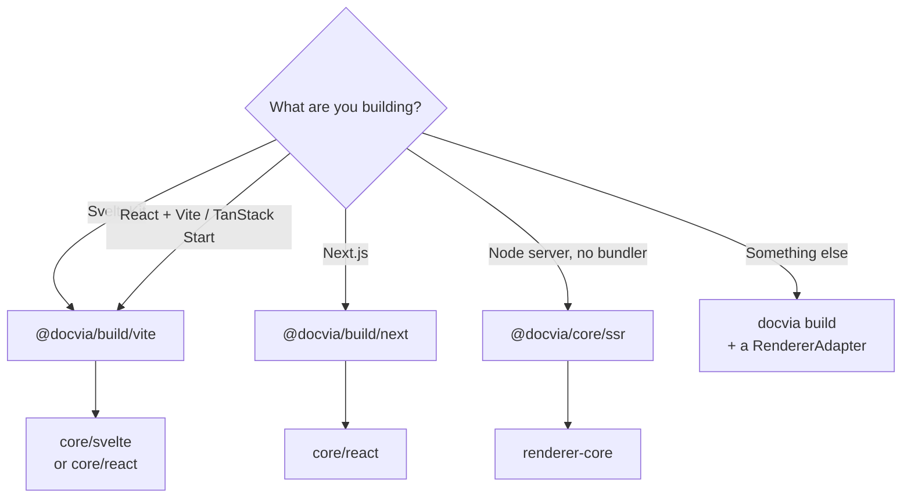

docvia runs **in-process** inside your bundler. The Vite plugin and the Next.js
wrapper rewrite `defineDocs()` calls at build time and compile page bodies on
demand, so there is no separate build step, no `.docvia/` folder, and dev
recompiles only the page you edit. Imports are plain package subpaths
(`@docvia/core/source`, `@docvia/core/source/macro`), identical on Vite and Next.js.

The pattern is the same everywhere:

1. Author a `docvia.config.ts` with the renderer that matches your framework.
2. Add the framework's docvia plugin or wrapper.
3. Declare a collection with `defineDocs()` and wrap it in `loader()`.
4. Load pages with `source.getPage()` and render them with the framework
   renderer.


```mermaid
%% title: Picking an integration
flowchart TD
  Q{"What are you building?"}
  Q -- "SvelteKit" --> V["@docvia/build/vite"]
  Q -- "React + Vite / TanStack Start" --> V
  Q -- "Next.js" --> N["@docvia/build/next"]
  Q -- "Node server, no bundler" --> S["@docvia/core/ssr"]
  Q -- "Something else" --> C["docvia build<br/>+ a RendererAdapter"]
  V --> RS["core/svelte<br/>or core/react"]
  N --> RR["core/react"]
  S --> RC["renderer-core"]
```

Every setup shares the same two macro files:

```ts title="lib/source.ts"
import { loader } from "@docvia/core/source";
import { defineDocs } from "@docvia/core/source/macro";
import { z } from "zod";

const docs = defineDocs({
  dir: "content/docs",
  // Optional: extra frontmatter fields, any Standard Schema library.
  docs: { schema: z.object({ author: z.string().optional() }) },
});

export const source = loader({ baseUrl: "/docs", source: docs.toDocviaSource() });
```

```ts title="lib/registry.ts"
import { defineRegistry } from "@docvia/core/source/macro";

// Components from `components` in docvia.config.ts.
export const registry = defineRegistry();
```

`dir` is relative to the project root and must be a string literal. The
[`@docvia/core/source`](/docs/packages/core/source) page documents every `loader()`
method.

## SvelteKit

SvelteKit runs on Vite, so the integration is the single `docvia()` plugin
from [`@docvia/build/vite`](/docs/packages/build/vite). The snippets below
target SvelteKit 3 and TypeScript 6.

### 1. Install

```bash
pnpm add -D @docvia/build
pnpm add @docvia/core
```

### 2. Configure docvia

Use the Svelte renderer, taking care to use the `/node` subpath, which is the
build-time entry point. Add `@docvia/plugin-shiki` for syntax highlighting.

```ts
// docvia.config.ts
import { defineConfig } from "@docvia/build/vite";
import { createSvelteRenderer } from "@docvia/core/svelte/node";
import { shiki } from "@docvia/plugin-shiki";

export default defineConfig({
  renderer: createSvelteRenderer(),
  plugins: [shiki({ theme: "github-dark" })],
});
```

### 3. Add the Vite plugin

Called with no arguments, `docvia()` loads `docvia.config.*` from the Vite root
(`docvia(config)` also works). SvelteKit 3 has no `svelte.config.js`: its
options go into `sveltekit({ ... })`.

```ts
// vite.config.ts
import { docvia } from "@docvia/build/vite";
import adapter from "@sveltejs/adapter-auto";
import { sveltekit } from "@sveltejs/kit/vite";
import { defineConfig } from "vite";

export default defineConfig({
  plugins: [sveltekit({ adapter: adapter() }), docvia()],
});
```

Your workflow stays `pnpm dev` and `pnpm build`. Nothing is generated on disk,
so `svelte-check` needs no extra sync step.

### 4. Declare the collection

Put the two macro files from above in `src/lib/source.ts` and
`src/lib/registry.ts`, with `dir` pointing at your Markdown (for example
`"src/docs"`).

### 5. Consume pages in a route

Load the page on the server and render it with the `Renderer` component from
`@docvia/core/svelte`.

```ts
// src/routes/docs/[...slug]/+page.server.ts
import { error } from "@sveltejs/kit";
import { source } from "$lib/source";
import type { PageServerLoad } from "./$types";

export const load: PageServerLoad = async ({ params }) => {
  const page = source.getPage(params.slug?.split("/").filter(Boolean));
  if (!page) error(404, "Page not found");
  const { content, headings } = await page.data.load();
  return { page: { title: page.data.title, content, headings } };
};
```

```svelte
<!-- src/routes/docs/[...slug]/+page.svelte -->
<script lang="ts">
  import { Renderer } from "@docvia/core/svelte";
  import { registry } from "$lib/registry";
  import type { PageProps } from "./$types";

  let { data }: PageProps = $props();
</script>

<article>
  <Renderer nodes={data.page.content} {registry} />
</article>
```

Return `source.pageTree` from `+layout.server.ts` for the sidebar. The
[`apps/web`](https://github.com/kanakkholwal/docvia/tree/main/apps/web) app in
this repository is a complete working example: the site you are reading is
compiled by docvia.

## Next.js

For Next.js, [`@docvia/build/next`](/docs/packages/build/next) does the
wiring for **both webpack and Turbopack**.

### 1. Install

```bash
pnpm add -D @docvia/build
pnpm add @docvia/core react react-dom
```

### 2. Configure docvia

```ts
// docvia.config.ts
import { defineConfig } from "@docvia/build/next";
import { createReactRenderer } from "@docvia/core/react";
import { shiki } from "@docvia/plugin-shiki";

export default defineConfig({
  renderer: createReactRenderer(),
  plugins: [shiki({ theme: "github-dark" })],
});
```

### 3. Wrap the Next config

```ts
// next.config.ts
import { withDocvia } from "@docvia/build/next";

const withDocs = withDocvia();

export default withDocs({ reactStrictMode: true });
```

`withDocvia` rewrites macro files named `source.{ts,tsx,js,mjs}` or
`registry.{ts,tsx,js}`. Override the list with
`withDocvia({ macroFiles: ["docs-source.ts"] })`, and the config location with
`configPath`.

### 4. Consume pages in a route

```tsx
// app/docs/[[...slug]]/page.tsx
import { Renderer } from "@docvia/core/react";
import { notFound } from "next/navigation";
import { registry } from "@/lib/registry";
import { source } from "@/lib/source";

export function generateStaticParams() {
  return source.generateParams();
}

export default async function DocPage({
  params,
}: {
  params: Promise<{ slug?: string[] }>;
}) {
  const { slug } = await params;
  const page = source.getPage(slug);
  if (!page) notFound();
  const { content } = await page.data.load();
  return <Renderer nodes={content} registry={registry} />;
}
```

`Renderer` carries no `"use client"` directive, so it renders as a React
Server Component. For deferred islands, pass `manifest` from `load()` to
`hydrate` from `@docvia/core/react/client` in a client component.

## React with Vite

Add the same `docvia()` plugin next to `@vitejs/plugin-react`:

```ts
// vite.config.ts
import { docvia } from "@docvia/build/vite";
import react from "@vitejs/plugin-react";
import { defineConfig } from "vite";

export default defineConfig({
  plugins: [react(), docvia()], // loads ./docvia.config.ts
});
```

`source` is safe to import from client code: the frontmatter index is inlined,
and each page body is its own lazy chunk fetched by `page.data.load()`.

```tsx
import { Renderer } from "@docvia/core/react";
import { use } from "react";
import { registry } from "./lib/registry";
import { source } from "./lib/source";

export function DocPage({ slugs }: { slugs: string[] }) {
  const page = source.getPage(slugs);
  if (!page) return <p>Not found</p>;
  const { content } = use(page.data.load());
  return <Renderer nodes={content} registry={registry} />;
}
```

## TanStack Start

TanStack Start runs on Vite, so add `docvia()` to its Vite config. Route loaders
run in the browser too, so load the page in a server function: that keeps
`lib/source.ts`, and the index of every page, out of the browser bundle, and the
page JS stays the same size however many pages you have.

```tsx
// src/routes/docs/$.tsx
import { Renderer } from "@docvia/core/react";
import { createFileRoute, notFound } from "@tanstack/react-router";
import { createServerFn } from "@tanstack/react-start";
import { registry } from "@/lib/registry";
import { source } from "@/lib/source";

const getPage = createServerFn({ method: "GET" })
  .inputValidator((slugs: string[]) => slugs)
  .handler(async ({ data: slugs }) => {
    const page = source.getPage(slugs);
    if (!page) throw notFound();
    const { content, toc } = await page.data.load();
    return { title: page.data.title, content, toc };
  });

export const Route = createFileRoute("/docs/$")({
  loader: ({ params }) =>
    getPage({ data: (params._splat ?? "").split("/").filter(Boolean) }),
  component: DocPage,
});

function DocPage() {
  const { content } = Route.useLoaderData();
  return <Renderer nodes={content} registry={registry} />;
}
```

## Server-side rendering

**Inside a framework app you need nothing extra.** `page.data.load()` runs at
request time on Node, Cloudflare Workers, and other edge runtimes: there is no
`node:fs` and no Markdown parsing on the request path. Page bodies stay lazy
chunks, so a Worker's cold start loads only the frontmatter index, not every
page.

For a **non-framework Node server** that renders per request, use
[`@docvia/core/ssr`](/docs/packages/core/ssr). It renders one document per request and
caches rendered pages in an in-memory LRU keyed by content hash.
`createDocviaSSR` takes a generic content source. A live `CompileService`
already satisfies the shape, so pass it directly, or pass a
`(collection, slug) => IR` function:

```ts
import { createDocviaSSR } from "@docvia/core/ssr";

const ssr = createDocviaSSR({ provider: service }); // or (collection, slug) => IR
const page = await ssr.render("docs", "getting-started");
```

## Standalone preview

Without a bundler, `docvia build` writes a module graph to `outDir`, and
`docvia preview` serves it over `sirv`:

```bash
docvia preview --out .docvia --port 4173
```

This is a sanity check for the standalone output, **not** a runtime. For an
actual site, use one of the integrations above.

> Legacy config collections (`collections`, `sourceDir`, `outDir` in
> `docvia.config.ts`, imported through `virtual:docvia/source` or
> `docvia/source`) still work, but new apps should use `defineDocs()`.

## Choosing an approach

| Your app | Integration | Renderer |
|---|---|---|
| SvelteKit | `@docvia/build/vite` (`docvia()`) | `@docvia/core/svelte` |
| Next.js (webpack or Turbopack) | `@docvia/build/next` (`withDocvia()`) | `@docvia/core/react` |
| React with Vite | `@docvia/build/vite` (`docvia()`) | `@docvia/core/react` |
| TanStack Start | `@docvia/build/vite` (`docvia()`) | `@docvia/core/react` |
| Plain Vite (Svelte) | `@docvia/build/vite` (`docvia()`) | `@docvia/core/svelte` |
| Request-time SSR without a bundler | `@docvia/core/ssr` | `@docvia/core/render` |
| Any other framework | `docvia build` + `@docvia/core/source` | write a `RendererAdapter` |
