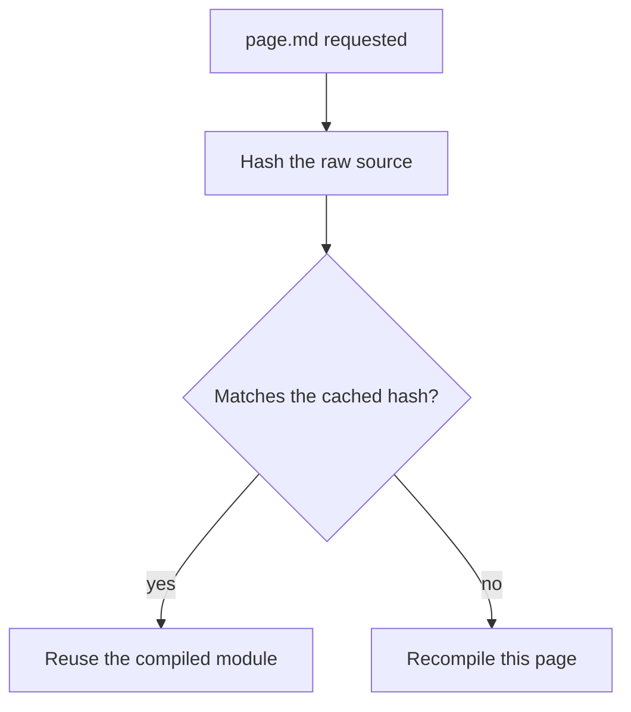

docvia treats your docs the way a bundler treats source code: pages compile
lazily, the first time the bundler asks for them, and each result is memoised
by content hash. An edit recompiles only the page you changed.

## The in-memory cache

[`@docvia/runtime`](/docs/packages/runtime)'s `PagePipeline` keeps one entry
per page, keyed by collection and file path, holding an `xxh64` hash of the
raw source plus the compiled IR and rendered module. Nothing is written to
disk: there is no `.docvia/` folder and no cache file.

A failed compile is not cached, so the next request retries.

## The content hash

Each compiled page also carries a **composite** `contentHash` in its IR, used
by downstream caches such as the [`@docvia/ssr`](/docs/packages/ssr) LRU. The
inputs are:

| Input | Why it matters |
|---|---|
| File content | The Markdown itself changed. |
| Frontmatter | A metadata change can alter the output. Keys listed in the config's `hashExclude` are left out, for derived or volatile values. |
| Config hash | A different config can produce different output. |
| Plugin cache keys | A plugin's behavior or input changed. |

Hashing uses `xxh64` rendered in base-36.

## When everything recompiles

The cache lives as long as the pipeline. A new process (every production
build) starts empty. When `docvia()` loaded `docvia.config.ts` itself, editing
the config restarts the Vite dev server with a fresh pipeline.

A plugin that depends on an external input should still implement
`cacheKey()` (see [Writing plugins](/docs/guide/plugins)), so the input is part
of every page's `contentHash`.

## Forcing a full rebuild

Restart the dev server, or rerun the build. There is no persisted cache to
clear, so the old `--no-cache` flag is gone.

## In dev and framework integrations

The bundler plugins hold one pipeline for the life of the dev server. Under
Vite, a body-only edit recompiles and hot-swaps that one page; a
frontmatter edit, add, or delete re-indexes the collection's frontmatter
without recompiling other bodies. See
[Framework integration](/docs/guide/frameworks).
