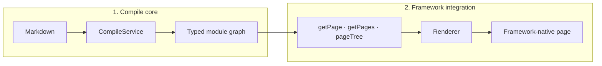

The guides cover docvia from the user's side: how to configure it, wire it
into an app, and extend it. For the API surface of an individual package, see
the [Packages](/docs/packages) reference.

## In this section

- [Configuration](/docs/guide/configuration) lists every option accepted by
  `defineConfig`, with defaults and types.
- [Framework integration](/docs/guide/frameworks) covers SvelteKit, Next.js, and
  plain Vite setups.
- [CLI reference](/docs/guide/cli) documents every `docvia` command and flag.
- [Writing plugins](/docs/guide/plugins) explains the five pipeline hook points
  and how to author a plugin.
- [Architecture](/docs/guide/architecture) describes the compile pipeline, the
  IR, and the generated module graph.
- [Incremental builds](/docs/guide/incremental-builds) covers how the
  content-hash cache decides what to rebuild.

## The mental model

docvia has two halves:

1. **The compile core** (`CompileService`) reads Markdown, runs it through the
   pipeline, and produces a typed module graph, at build time, in the dev
   server, or per request.
2. **A framework integration** consumes that module graph. The source module
   (`virtual:docvia/source` on Vite, `docvia/source` on Next.js) gives you
   `getPage`, `getPages`, and `pageTree`, and a renderer turns each page's
   content into framework-native output.

The same core runs in three modes, build, dev, and SSR, so their output is
identical. Plugins, the frontmatter schema, the incremental cache, and syntax
highlighting are all details of how the core produces that module graph. See
[Architecture](/docs/guide/architecture) for the full picture.
