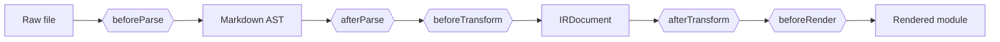
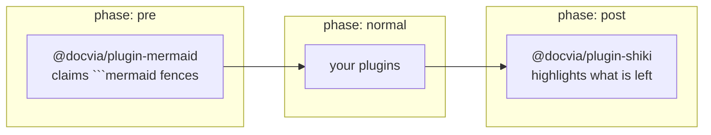

A docvia plugin is a plain object that taps one or more points in the compile
pipeline. Plugins are how the OpenAPI integration, Mermaid diagrams, custom
transforms, and content generation are built, all without forking the compiler.

## The plugin shape

A plugin implements the `docviaPlugin` interface from
[`@docvia/ir`](/docs/packages/ir):

| Field | Type | Description |
|---|---|---|
| `name` | `string` | Unique plugin name. Required. |
| `version` | `string` | Plugin version. Required. |
| `phase` | `"pre" \| "normal" \| "post"` | Execution phase. Default `"normal"`. |
| `priority` | `number` | Tie-break within a phase. Default `100`; lower runs first. |
| `cacheKey()` | `() => string` | Contributes to the build cache key. |
| `beforeParse` | hook | See below. |
| `afterParse` | hook | See below. |
| `beforeTransform` | hook | See below. |
| `afterTransform` | hook | See below. |
| `beforeRender` | hook | See below. |

`name` and `version` are mandatory. [`resolvePlugins`](/docs/packages/plugins)
throws a `PLUGIN_ERROR` for a plugin that omits either, or for a duplicated
name.

## The five hook points

The pipeline runs each file through these stages in order. A hook may be
synchronous or return a `Promise`; whatever it returns is threaded into the
next plugin and then the next stage.



| Hook | Signature | Runs |
|---|---|---|
| `beforeParse` | `(file: FileEntry) => FileEntry` | On the raw file, before Markdown parsing. |
| `afterParse` | `(ast, file: FileEntry) => ast` | On the parsed Markdown AST. |
| `beforeTransform` | `(ast, meta: FrontmatterData) => ast` | On the AST, before IR conversion. |
| `afterTransform` | `(doc: IRDocument) => IRDocument` | On the IR document. |
| `beforeRender` | `(doc: IRDocument) => IRDocument` | On the IR, just before rendering. |

Use `beforeParse` to rewrite raw text, `afterParse` to manipulate Markdown
nodes (this is where [`@docvia/plugin-openapi`](/docs/packages/plugin-openapi) does
its work), and `afterTransform` / `beforeRender` to act on the
framework-agnostic IR. Two first-party plugins work on the IR:
[`@docvia/plugin-shiki`](/docs/packages/plugin-shiki) bakes highlighted HTML
onto `code-block` nodes, and
[`@docvia/plugin-mermaid`](/docs/packages/plugin-mermaid) rewrites diagram
fences into component nodes.

## Execution order

Plugins are sorted by `phase`, in the order `pre`, `normal`, `post`, and within
a phase by ascending `priority`. A failure inside any hook is wrapped in a
`docviaError` with code `PLUGIN_ERROR`, naming the plugin and the hook, so a
broken plugin never produces a mystery stack trace.



## A minimal plugin

```ts
import type { docviaPlugin } from "@docvia/ir";

export function upperTitles(): docviaPlugin {
  return {
    name: "upper-titles",
    version: "1.0.0",
    phase: "post",
    afterTransform: (doc) => ({
      ...doc,
      frontmatter: {
        ...doc.frontmatter,
        title: doc.frontmatter.title.toUpperCase(),
      },
    }),
  };
}
```

Register it in your config:

```ts
import { defineConfig } from "@docvia/cli";
import { upperTitles } from "./plugins/upper-titles";

export default defineConfig({
  plugins: [upperTitles()],
  // ...
});
```

## Rendering custom content

A plugin that wants to draw something the Markdown grammar has no syntax for
can rewrite a node into a `component` node. The renderer then resolves that
name against the `ComponentRegistry` your app passes in, which keeps the
drawing library out of the compiler and out of the server bundle.
[`@docvia/plugin-mermaid`](/docs/packages/plugin-mermaid) is the reference
implementation:

```ts
if (node.type === "code-block" && node.props.lang === "mermaid") {
  return {
    type: "component",
    id: node.id,
    props: {
      name: "Mermaid",
      hydrate: "none",
      attributes: { code: String(node.props.value ?? "").trim() },
    },
    children: [],
  };
}
```

## Caching

If your plugin depends on an external input, such as a spec file, an
environment variable, or a remote source, implement `cacheKey()`. Its return
value is folded into the build cache key, so when the input changes every
affected page is rebuilt. When you omit it, docvia falls back to
`name@version`. See [Incremental builds](/docs/guide/incremental-builds) for how
the cache key drives rebuilds.
