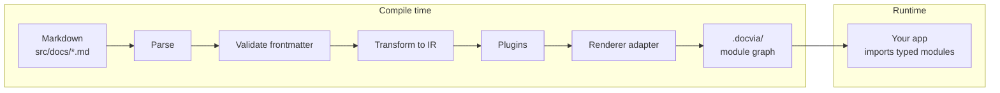
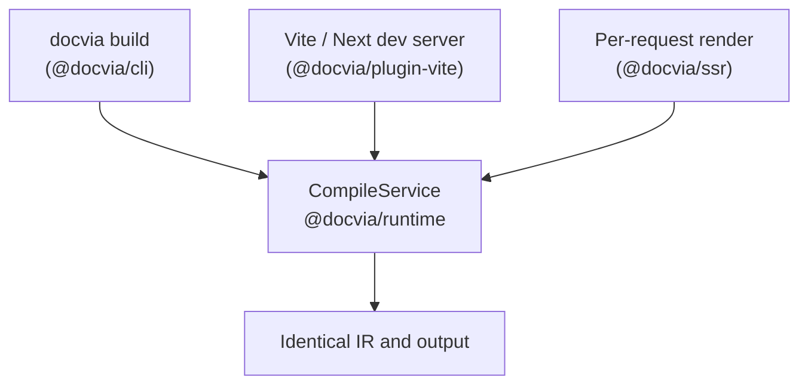

**docvia** turns a directory of Markdown into typed, pre-rendered content. No
runtime Markdown parser is shipped to the browser. Every page is parsed,
sanitized, and transformed into an Intermediate Representation (IR) before it
reaches your app.

This documentation site is itself compiled by docvia. Every page you are
reading is a Markdown file under `apps/web/src/docs/`, run through the compile
core and rendered by `@docvia/renderer-svelte`.

## Why a compiler?

Most documentation toolchains ship the Markdown parser to the browser, or walk
it on every server request. docvia treats your docs the way a modern bundler
treats your source code: hash content, cache aggressively, and emit a tiny
module graph the bundler can tree-shake.

The result is a clean separation:

- **Compile time.** Markdown is parsed, validated, transformed to an IR, and
  rendered to framework-native output.
- **Runtime.** Your app consumes plain modules. No parser, no `unified`, no
  `remark`, and no syntax highlighter in the client bundle.



## Three modes, one core

docvia runs in three modes, all driven by a single stateful `CompileService`
(see [Architecture](/docs/guide/architecture)), so their output is identical:

- **Build.** Compile the whole tree ahead of time into a typed module graph.
- **Dev.** Compile in-process inside the framework dev server, recompiling
  incrementally on every file change. No separate build script.
- **SSR.** Render a single document per request, on Node or the edge.



## Highlights

- **No runtime Markdown parser.** Pages are compiled to an IR; the client
  bundle ships neither a parser nor a syntax highlighter.
- **Incremental everywhere.** A content-hash cache skips unchanged files,
  across builds and, in dev, on every keystroke.
- **Typed end-to-end.** Frontmatter, route keys, and the generated `source`
  helper are all typed.
- **Pluggable pipeline.** Five hook points let you mutate the pipeline at any
  stage: `beforeParse`, `afterParse`, `beforeTransform`, `afterTransform`,
  `beforeRender`.
- **Pluggable highlighting.** Syntax highlighting is a build-time plugin
  (`@docvia/plugin-shiki`) that bakes highlighted HTML into the IR.
- **Framework adapters.** First-party React and Svelte renderers, an in-process
  Vite plugin, a Next.js wrapper, and an SSR package for Node and edge.

## How it fits together

```bash
docvia build          # Markdown ──▶ .docvia/ module graph
```

```ts
// Vite resolves a virtual module; Next.js aliases the bare specifier.
import { docs } from "virtual:docvia/source"; // Next.js: "docvia/source"

const page = await docs.getPage(["getting-started"]);
const tree = docs.pageTree; // navigation tree
```

A framework integration (the Vite plugin or the Next.js wrapper) runs the
compile core for you and resolves the source module to the compiled output, so
your app only ever imports typed modules.

## Next steps

- [Getting started](/docs/getting-started) covers installing the CLI and
  compiling your first build.
- [Configuration](/docs/guide/configuration) lists every option accepted by
  `defineConfig`.
- [Framework integration](/docs/guide/frameworks) wires docvia into SvelteKit,
  Next.js, a plain Vite app, or a server.
- [Architecture](/docs/guide/architecture) explains the compile core, the three
  run modes, and the IR.
- [Packages](/docs/packages) is the full reference for every `@docvia/*`
  package.
