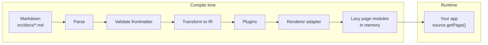
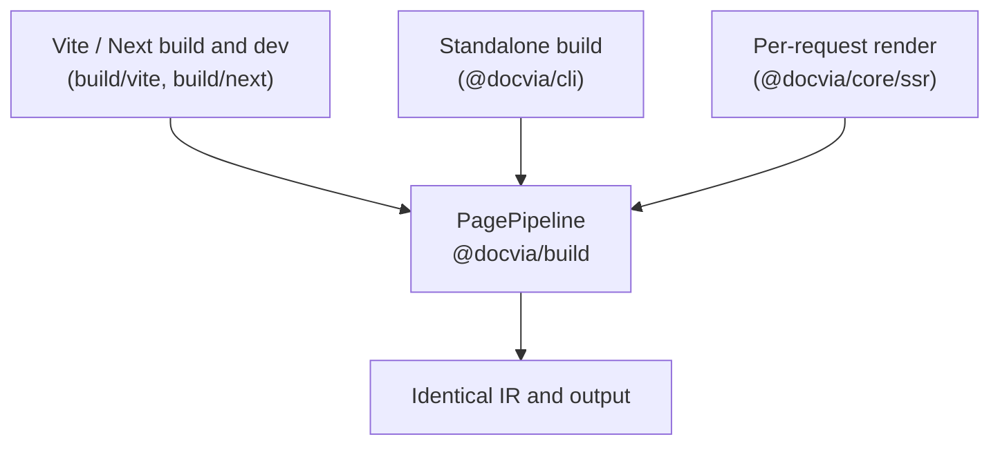

**docvia** turns a directory of Markdown into typed, pre-rendered content. No
runtime Markdown parser is shipped to the browser. Every page is parsed,
sanitized, and transformed into an Intermediate Representation (IR) before it
reaches your app.

This documentation site is itself compiled by docvia. Every page you are
reading is a Markdown file under `apps/web/src/docs/`, run through the compile
core and rendered by `@docvia/core/svelte`.

## Why a compiler?

Most documentation toolchains ship the Markdown parser to the browser, or walk
it on every server request. docvia treats your docs the way a modern bundler
treats your source code: compile inside the bundler, memoise by content hash,
and load each page body lazily.

The result is a clean separation:

- **Compile time.** Markdown is parsed, validated, transformed to an IR, and
  rendered to framework-native output.
- **Runtime.** Your app consumes plain modules. No parser, no `unified`, no
  `remark`, and no syntax highlighter in the client bundle.


```mermaid
%% title: The compile-time / runtime split
flowchart LR
  MD["Markdown<br/>src/docs/*.md"] --> P[Parse]
  P --> V[Validate frontmatter]
  V --> T[Transform to IR]
  T --> PL[Plugins]
  PL --> R[Renderer adapter]
  R --> G["Lazy page modules<br/>in memory"]
  G --> A["Your app<br/>source.getPage()"]

  subgraph compile ["Compile time"]
    MD
    P
    V
    T
    PL
    R
    G
  end

  subgraph runtime ["Runtime"]
    A
  end
```

## Three modes, one core

docvia runs in three modes, all driven by the same `PagePipeline` from
`@docvia/build` (see [Architecture](/docs/guide/architecture)), so their
output is identical:

- **Build.** The bundler plugin compiles pages as part of `vite build` or
  `next build`.
- **Dev.** Compile in-process inside the framework dev server, recompiling
  incrementally on every file change. No separate build script.
- **SSR.** Render a single document per request, on Node or the edge.


```mermaid
%% title: One pipeline behind all three modes
flowchart TD
  VITE["Vite / Next build and dev<br/>(build/vite, build/next)"] --> CS
  CLI["Standalone build<br/>(@docvia/cli)"] --> CS
  SSR["Per-request render<br/>(@docvia/core/ssr)"] --> CS
  CS["PagePipeline<br/>@docvia/build"] --> OUT[Identical IR and output]
```

## Highlights

- **No runtime Markdown parser.** Pages are compiled to an IR; the client
  bundle ships neither a parser nor a syntax highlighter.
- **Incremental everywhere.** Pages compile lazily and are memoised by
  content hash, so an edit recompiles only that page.
- **Typed end-to-end.** `defineDocs()` infers frontmatter types from your
  schema; no generated type files.
- **Pluggable pipeline.** Five hook points let you mutate the pipeline at any
  stage: `beforeParse`, `afterParse`, `beforeTransform`, `afterTransform`,
  `beforeRender`.
- **Pluggable highlighting.** Syntax highlighting is a build-time plugin
  (`@docvia/plugin-shiki`) that bakes highlighted HTML into the IR.
- **Framework adapters.** First-party React and Svelte renderers, an in-process
  Vite plugin, a Next.js wrapper, and an SSR package for Node and edge.

## How it fits together

```ts title="lib/source.ts"
import { loader } from "@docvia/core/source";
import { defineDocs } from "@docvia/core/source/macro";

const docs = defineDocs({ dir: "content/docs" });

export const source = loader({ baseUrl: "/docs", source: docs.toDocviaSource() });
```

```ts
const page = source.getPage(["getting-started"]); // frontmatter only
const { content } = await page.data.load(); // compiled body, lazy
const tree = source.pageTree; // navigation tree
```

The bundler plugin (Vite or Next.js) rewrites `defineDocs()` at build time, so
your app imports plain package subpaths and never the compiler.

## Next steps

- [Getting started](/docs/getting-started) covers installing docvia and
  rendering your first page.
- [Configuration](/docs/guide/configuration) lists every option accepted by
  `defineConfig`.
- [Framework integration](/docs/guide/frameworks) wires docvia into SvelteKit,
  Next.js, a plain Vite app, or a server.
- [Architecture](/docs/guide/architecture) explains the compile core, the three
  run modes, and the IR.
- [Packages](/docs/packages) is the full reference for every `@docvia/*`
  package.
