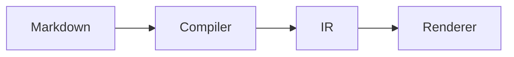

`@docvia/plugin-mermaid` renders [Mermaid](https://mermaid.js.org) diagrams
written as fenced code blocks. During compilation its `beforeRender` hook
rewrites every ` ```mermaid ` block into a `component` node, and your app
supplies the component that draws it through the renderer's
`ComponentRegistry`.

Mermaid itself is never a compiler dependency. The compiler only moves a string
from one node type to another, so nothing is added to the build, the server
bundle, or the edge bundle.

## Installation

```bash
pnpm add -D @docvia/plugin-mermaid
pnpm add mermaid
```

Requires Node.js `>=20.0.0`. ESM only.

## Usage

Register it in the `plugins` array of your `docvia.config.ts`. Put it before
any highlighter so diagram fences are claimed first:

```ts
import { defineConfig } from "@docvia/cli";
import { mermaid } from "@docvia/plugin-mermaid";
import { shiki } from "@docvia/plugin-shiki";
import { createSvelteRenderer } from "@docvia/renderer-svelte/node";

export default defineConfig({
  sourceDir: "src/docs",
  outDir: ".docvia",
  renderer: createSvelteRenderer(),
  plugins: [mermaid(), shiki({ theme: "github-dark" })],
});
```

The plugin declares `phase: "pre"`, so the ordering holds even if you list it
after the highlighter.

## How it works

```mermaid
%% title: A diagram fence through the pipeline
flowchart LR
  F["```mermaid<br/>graph TD; A--&gt;B;<br/>```"] --> CB["code-block node<br/>lang: mermaid"]
  CB --> P["@docvia/plugin-mermaid<br/><i>phase: pre</i>"]
  P --> CN["component node<br/>name: Mermaid<br/>attributes: { code, title }"]
  CN --> R["Renderer + ComponentRegistry"]
  R --> SVG["Your component draws the SVG"]
```

1. The `beforeRender` hook receives the document IR.
2. It walks the tree for `code-block` nodes whose language matches `lang`
   (default `"mermaid"`).
3. Each match becomes a `component` node named after the `component` option
   (default `"Mermaid"`), carrying the diagram source as `code` and any leading
   `%% title:` comment as `title`. The original node's `id` is reused, so ids
   stay stable across edits that do not touch the diagram.
4. Everything else passes through untouched, so a highlighter running later
   sees only real code blocks.

## Options

| Option | Type | Default | Description |
|---|---|---|---|
| `lang` | `string` | `"mermaid"` | Fence info string that marks a diagram. |
| `component` | `string` | `"Mermaid"` | Component name emitted into the IR. |
| `props` | `Record<string, unknown>` | `{}` | Extra props merged into every diagram component. |

`cacheKey()` is derived from all three, so changing any of them invalidates the
incremental cache.

## Drawing the diagrams

Register a component under the emitted name and pass the registry to the
renderer:

```svelte
<script lang="ts">
  import { Renderer } from "@docvia/renderer-svelte";
  import Mermaid from "$lib/components/mermaid.svelte";
  import type { PageProps } from "./$types";

  let { data }: PageProps = $props();

  const registry = {
    resolve: (name: string) =>
      name === "Mermaid" ? { component: Mermaid } : null,
  };
</script>

<Renderer nodes={data.page.content} {registry} />
```

Inside that component, load `mermaid` with a **dynamic import** so it stays out
of the server bundle and off the initial page payload:

```svelte
<script lang="ts">
  import { browser } from "$app/environment";

  let { code, title }: { code: string; title?: string } = $props();
  let svg = $state("");

  $effect(() => {
    if (!browser) return;
    let current = true;
    (async () => {
      const { default: mermaid } = await import("mermaid");
      mermaid.initialize({ startOnLoad: false, securityLevel: "strict" });
      const { svg: out } = await mermaid.render("d", code);
      if (current) svg = out;
    })();
    return () => { current = false; };
  });
</script>

{#if svg}{@html svg}{:else}<pre>{code}</pre>{/if}
```

Rendering the raw source when `svg` is empty gives you a readable fallback for
SSR, prerendered HTML, browsers with JavaScript disabled, and diagrams Mermaid
cannot parse.

The site you are reading uses exactly this setup; see
[`apps/web/src/lib/components/docs/mermaid.svelte`](https://github.com/kanakkholwal/docvia/blob/main/apps/web/src/lib/components/docs/mermaid.svelte)
for the full component, including theme-aware colours and error handling.

## Authoring

Write ordinary Mermaid inside a fenced block:

````markdown

````

A leading `%% title:` line becomes the `title` prop and is stripped from the
diagram source. `%%` is Mermaid's own comment syntax, so the block still renders
correctly anywhere else it is pasted:

````markdown

````

The fence meta string (` ```mermaid My caption `) cannot be used for this:
[`@docvia/ir`](/docs/packages/ir) drops it when converting the HAST tree, so it
never reaches a plugin.

## See also

- [Writing plugins](/docs/guide/plugins) covers the plugin hook system and the
  component-node pattern.
- [`@docvia/plugin-shiki`](/docs/packages/plugin-shiki) is the highlighter that
  handles every remaining code block.
- [Architecture](/docs/guide/architecture) explains the IR that both plugins
  operate on.
