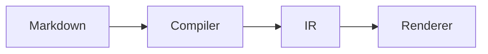

# @docvia/plugin-mermaid

[Mermaid](https://mermaid.js.org) diagrams for docvia.

The plugin rewrites every ` ```mermaid ` fenced block in the document IR into a
`component` node during compilation. Your app supplies the component that draws
it, through the renderer's `ComponentRegistry`. Mermaid itself is never a
compiler dependency, so nothing is added to the build or the edge bundle.

Diagrams are rewritten in the `pre` phase, ahead of highlighters such as
[`@docvia/plugin-shiki`](../plugin-shiki), so a diagram is never highlighted as
source code.

## Install

```bash
pnpm add -D @docvia/plugin-mermaid
```

## Configure

```ts
// docvia.config.ts
import { defineConfig } from "@docvia/cli";
import { mermaid } from "@docvia/plugin-mermaid";
import { shiki } from "@docvia/plugin-shiki";

export default defineConfig({
  plugins: [mermaid(), shiki({ theme: "github-dark" })],
});
```

## Draw the diagrams

The plugin emits a component named `Mermaid` with two props: `code` (the
diagram source) and `title` (an optional caption, see [Authoring](#authoring)).
Register a component under that name and pass the registry to the renderer:

```svelte
<script lang="ts">
  import { Renderer } from "@docvia/renderer-svelte";
  import Mermaid from "$lib/components/mermaid.svelte";

  const registry = {
    resolve: (name: string) => (name === "Mermaid" ? { component: Mermaid } : null),
  };
</script>

<Renderer nodes={page.content} {registry} />
```

Load the `mermaid` package inside that component with a dynamic import, so it
stays out of the server bundle and out of the initial page payload. See
[`apps/web/src/lib/components/docs/mermaid.svelte`](../../apps/web/src/lib/components/docs/mermaid.svelte)
for a complete implementation with theming, error handling, and a plain-text
fallback for browsers without JavaScript.

## Authoring

Write ordinary Mermaid inside a fenced block:

````markdown

````

A leading `%% title:` line becomes the caption and is stripped from the source.
`%%` is Mermaid's own comment syntax, so the block still renders anywhere else
it is pasted:

````markdown

````

The fence meta string cannot carry the caption: `@docvia/ir` drops it when
converting the HAST tree, so it never reaches a plugin.

## Options

| Option | Default | Description |
| --- | --- | --- |
| `lang` | `"mermaid"` | Fence info string that marks a diagram. |
| `component` | `"Mermaid"` | Component name emitted into the IR. |
| `props` | `{}` | Extra props merged into every diagram component. |

## Licence

MIT
